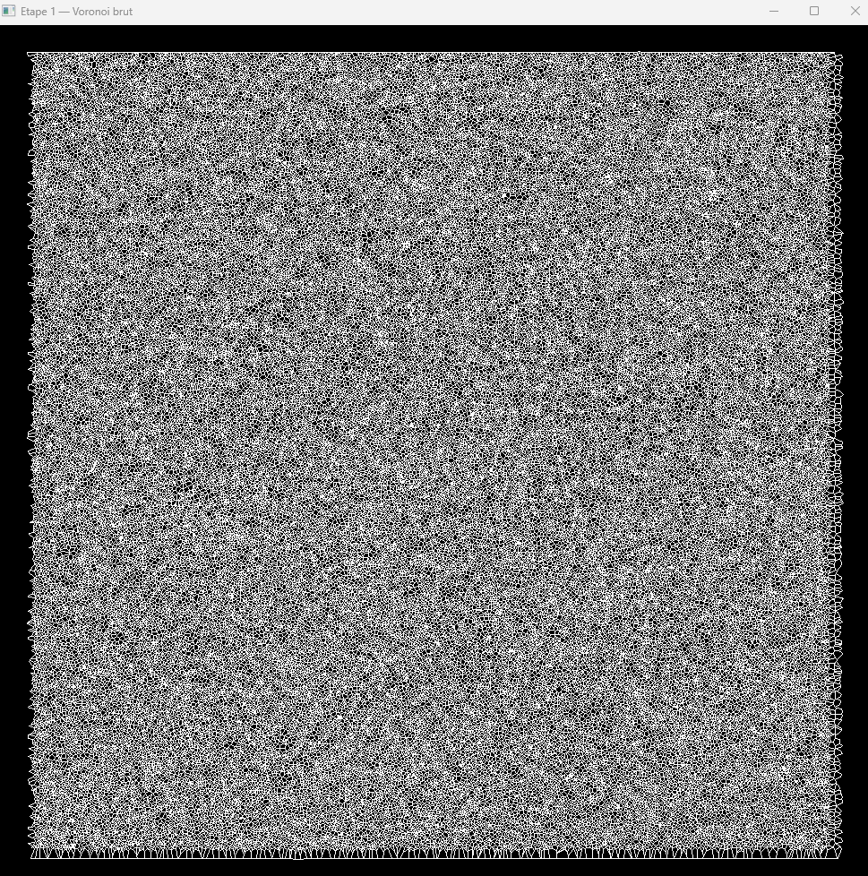
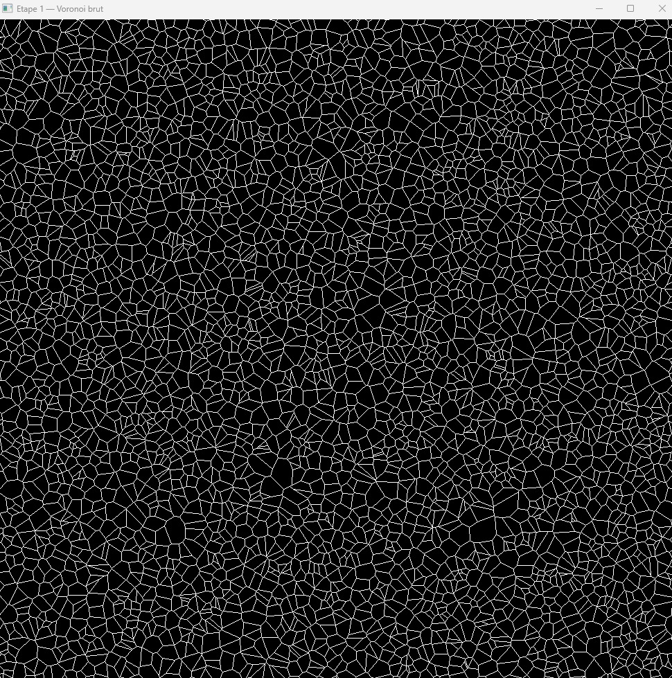
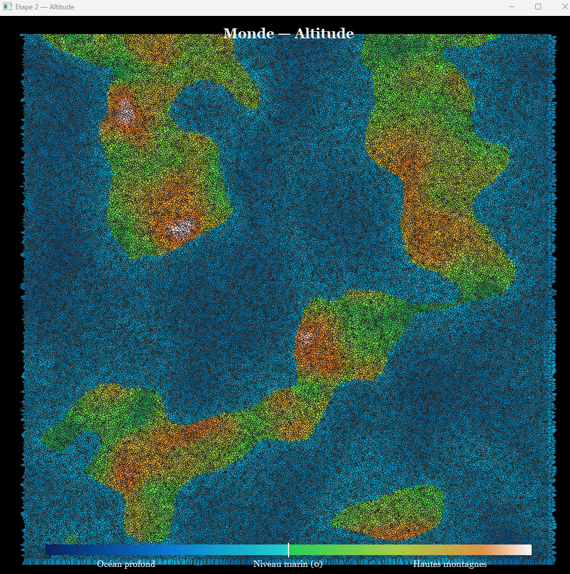
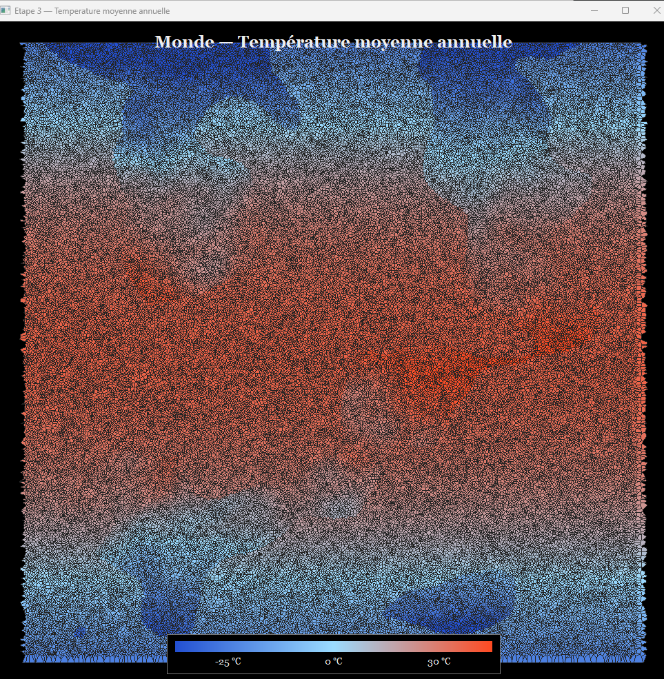
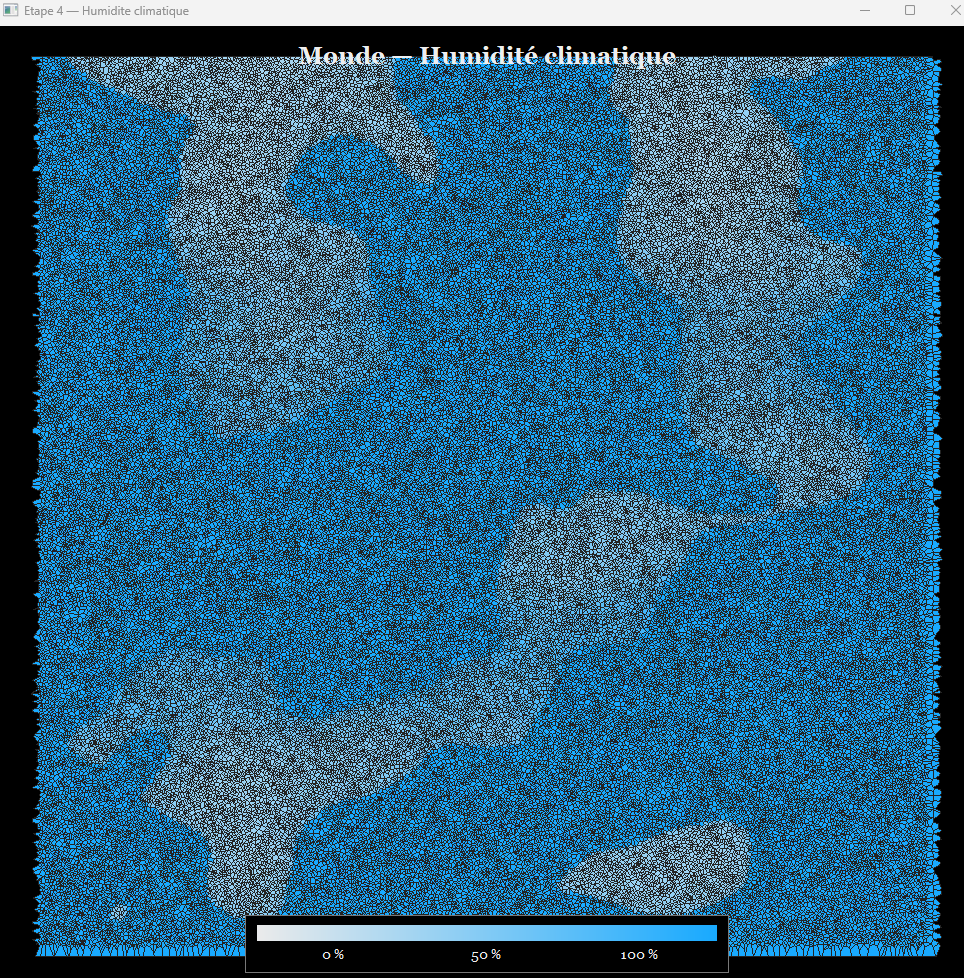
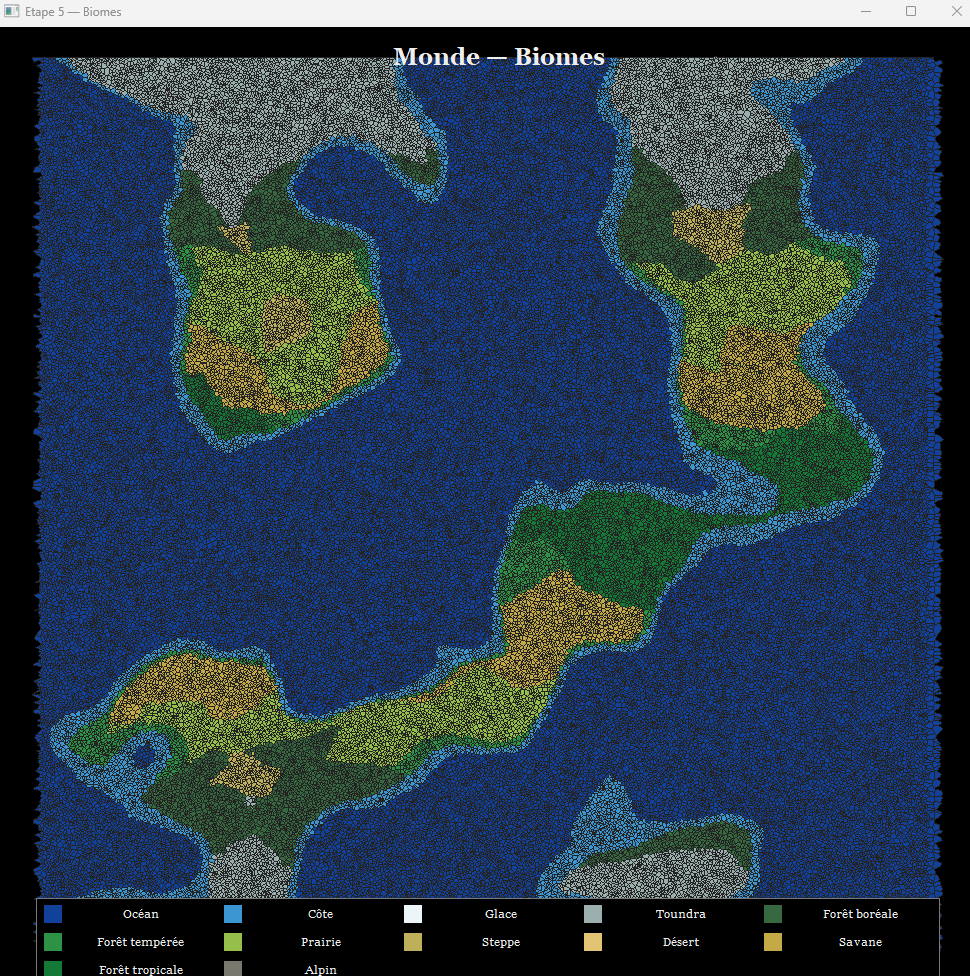
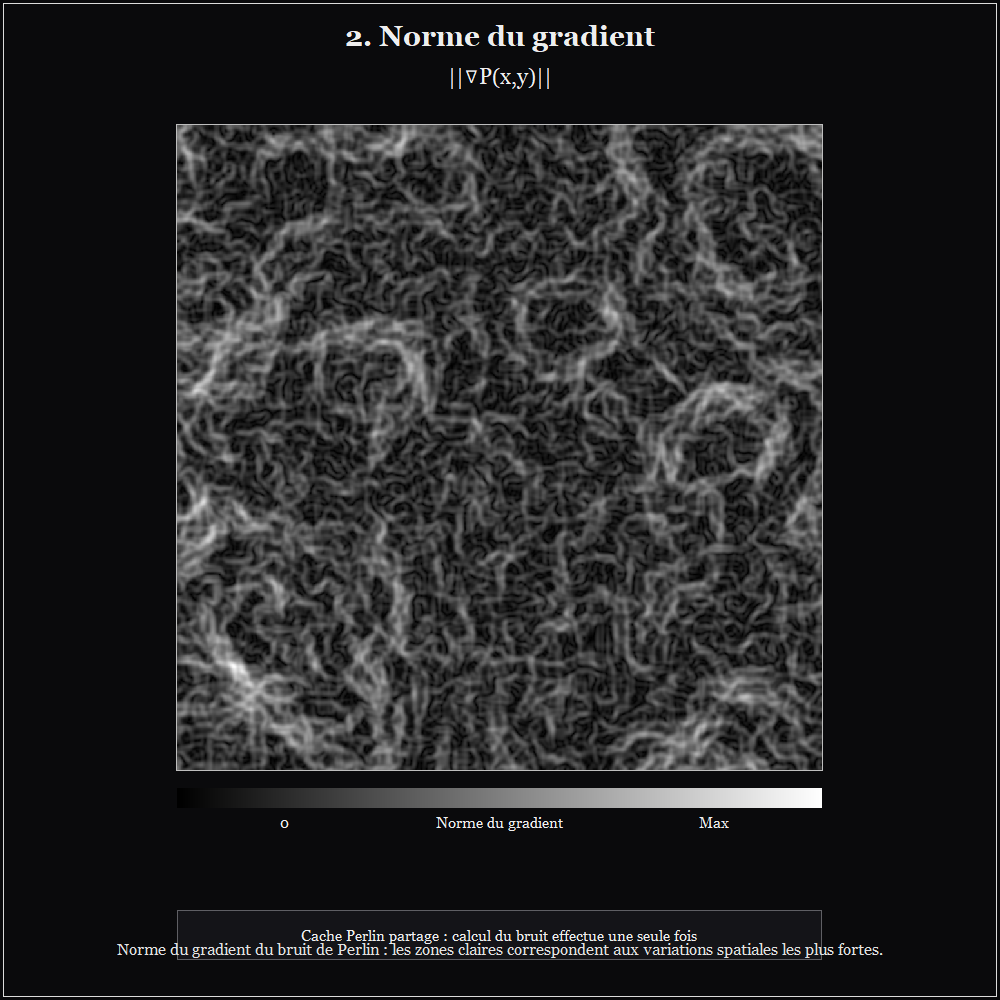
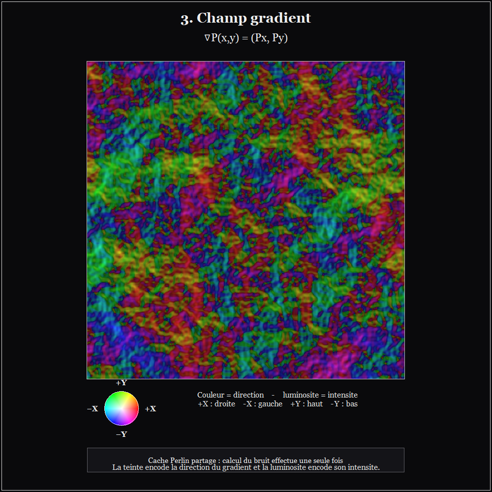
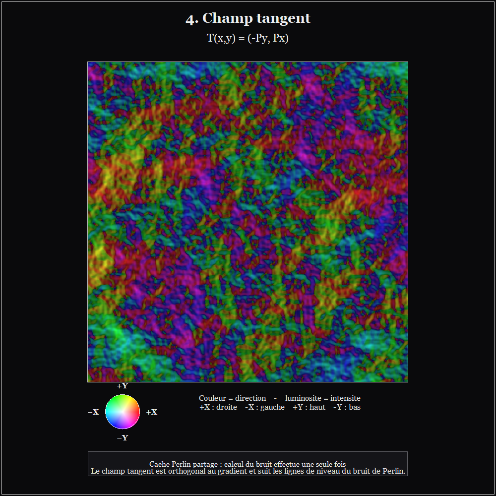
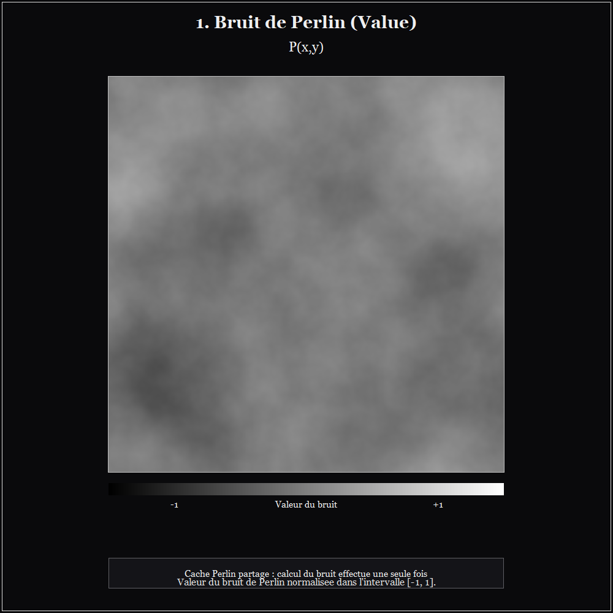

# Générateur de monde procédural — Voronoï, Perlin, tectonique, climat et biomes

Projet C++ de génération procédurale d'un monde 2D composé d'environ **100 000 territoires Voronoï**, puis enrichi par un pipeline mathématique et algorithmique allant du bruit de Perlin jusqu'à l'altitude, au climat et aux biomes.

L'objectif n'est pas de reproduire exactement une planète réelle, mais de construire un **monde cohérent, reproductible par seed et contrôlable par paramètres**, en combinant géométrie algorithmique, champs scalaires/vectoriels, calcul numérique et simulation climatique simplifiée.

---

## Sommaire

- [1. Vue d'ensemble](#1-vue-densemble)
- [2. Pipeline de génération](#2-pipeline-de-génération)
- [3. Voronoï](#3-voronoï)
- [4. Structure DCEL / Half-Edge](#4-structure-dcel--half-edge)
- [5. Bruit de Perlin](#5-bruit-de-perlin)
- [6. Interpolation de Perlin](#6-interpolation-de-perlin)
- [7. Bruit multi-octaves](#7-bruit-multi-octaves)
- [8. Périodicité et couture horizontale](#8-périodicité-et-couture-horizontale)
- [9. Domain warping](#9-domain-warping)
- [10. Champs gradient et tangent](#10-champs-gradient-et-tangent)
- [11. Champ tectonique](#11-champ-tectonique)
- [12. Passage du champ continu aux territoires](#12-passage-du-champ-continu-aux-territoires)
- [13. Génération de l'altitude](#13-génération-de-laltitude)
- [14. Océans, côtes et continents](#14-océans-côtes-et-continents)
- [15. Modèle climatique](#15-modèle-climatique)
- [16. Insolation et température](#16-insolation-et-température)
- [17. Graphe climatique et distance à l'eau](#17-graphe-climatique-et-distance-à-leau)
- [18. Transport de l'humidité et précipitations](#18-transport-de-lhumidité-et-précipitations)
- [19. Classification des biomes](#19-classification-des-biomes)
- [20. Reproductibilité et seed](#20-reproductibilité-et-seed)
- [21. Paramètres principaux](#21-paramètres-principaux)
- [22. Visualisations](#22-visualisations)
- [23. Résultats](#23-résultats)
- [24. Architecture logicielle](#24-architecture-logicielle)
- [25. Complexité algorithmique](#25-complexité-algorithmique)
- [26. Compilation et exécution](#26-compilation-et-exécution)
- [27. Arborescence](#27-arborescence)
- [28. Limites du modèle](#28-limites-du-modèle)
- [29. Pistes d'amélioration](#29-pistes-damélioration)

---

# 1. Vue d'ensemble

Le projet part d'un ensemble de points répartis dans un domaine rectangulaire :

$$
\Omega=[0,W]\times[0,H]
$$

avec actuellement :

$$
W=1000,\qquad H=1000
$$

et environ :

$$
N=100\,000
$$

sites.

Ces sites deviennent les cellules d'un diagramme de Voronoï. Chaque cellule représente ensuite un **territoire**.

Le monde est ensuite construit selon la chaîne :

```text
Sites aléatoires
      │
      ▼
Diagramme de Voronoï
      │
      ▼
DCEL / Half-Edge
      │
      ▼
Échantillonnage du bruit de Perlin
      │
      ├── valeur du bruit
      ├── gradient
      ├── norme du gradient
      ├── champ tangent
      └── champ tectonique
      │
      ▼
Continents / océans / côtes
      │
      ▼
Altitude
      │
      ▼
Latitude + insolation + altitude
      │
      ▼
Température
      │
      ▼
Graphe Voronoï + vents + humidité
      │
      ▼
Précipitations / humidité
      │
      ▼
Classification des biomes
```

Le projet utilise donc plusieurs types de données :

- **géométrie discrète** : cellules Voronoï ;
- **champs scalaires** : Perlin, altitude, température, humidité ;
- **champs vectoriels** : gradient, tangent, tectonique, vents ;
- **graphe** : voisinage des cellules Voronoï ;
- **simulation itérative** : transport de l'humidité ;
- **classification** : attribution finale d'un biome.

---

# 2. Pipeline de génération

Le programme principal construit la carte puis lance les visualisations.

Les grandes étapes sont :

### Étape 1 — Voronoï brut

Création des cellules géométriques à partir des sites.



Zoom



### Étape 2 — Altitude

Le champ procédural est converti en relief.



### Étape 3 — Température

La température dépend principalement de la latitude, du rayonnement reçu et de l'altitude.



### Étape 4 — Humidité

L'humidité est calculée à partir de l'influence de l'océan, du transport atmosphérique, des vents et du relief.



### Étape 5 — Biomes

La température, l'humidité, les précipitations et l'altitude sont combinées pour classer chaque territoire.



---

# 3. Voronoï

## 3.1 Définition mathématique

Soient des sites :

$$
P=\{p_1,p_2,\ldots,p_N\}
$$

Pour un site $p_i$, sa cellule de Voronoï est :

$$
V_i=
\{
x\in\Omega\mid 
\|x-p_i\|\leq\|x-p_j\|,
\quad\forall j\neq i
\}
$$

Autrement dit, chaque cellule contient les points dont le site générateur est le plus proche.

Les frontières sont constituées de lieux où deux sites sont à égale distance.

Pour deux sites $p_i=(x_i,y_i)$ et $p_j=(x_j,y_j)$, la frontière vérifie :

$$
\|x-p_i\|^2=\|x-p_j\|^2
$$

Après développement, les termes quadratiques s'annulent et on obtient une droite :

$$
2(p_j-p_i)\cdot x
=
\|p_j\|^2-\|p_i\|^2
$$

Cette propriété explique pourquoi les arêtes d'un diagramme de Voronoï sont rectilignes dans le plan euclidien.

## 3.2 Algorithme utilisé

Le projet implémente une version de **l'algorithme de Fortune**, annoncée en complexité :

$$
O(N\log N)
$$

La structure de Fortune repose notamment sur :

- une **beach line** ;
- des arcs paraboliques ;
- des événements de type `SITE` ;
- des événements de type `CIRCLE` ;
- une file de priorité ;
- un arbre rouge-noir pour organiser les arcs.

La beach line est parcourue par une ligne de balayage. Lorsqu'un nouveau site est rencontré, un nouvel arc apparaît. Lorsqu'un arc disparaît lors d'un événement circulaire, un sommet du diagramme peut être créé.

## 3.3 Gestion numérique

Le code utilise des tolérances dépendant de l'échelle :

$$
\varepsilon \propto
\epsilon_{\mathrm{machine}}
\max(|x|,|y|,|l|,1)
$$

Cela permet de réduire les problèmes liés aux comparaisons flottantes lorsque plusieurs événements ont des coordonnées presque identiques.

---

# 4. Structure DCEL / Half-Edge

Le Voronoï n'est pas simplement stocké comme une liste de polygones indépendants.

Le projet utilise une structure de type **DCEL (Doubly Connected Edge List)** avec notamment :

```text
Face
 └── HalfEdge
       ├── next
       ├── twin
       ├── incidentFace
       └── vertex
```

Une arête géométrique est représentée par deux demi-arêtes :

$$
e,\quad e^{twin}
$$

qui ont des directions opposées.

Cette organisation permet de parcourir efficacement :

- les sommets d'une cellule ;
- les arêtes d'une cellule ;
- les cellules voisines ;
- le graphe dual implicite du Voronoï.

Elle est particulièrement importante pour le calcul climatique, car les voisins d'un territoire sont ensuite obtenus directement à partir des relations `twin`.

---

# 5. Bruit de Perlin

Le projet implémente un bruit de Perlin 2D avec calcul simultané :

$$
(P(x,y),\nabla P(x,y))
$$

où :

$$
\nabla P=
(
\frac{\partial P}{\partial x},
\frac{\partial P}{\partial y}
)
$$

Le gradient est particulièrement important : il permet ensuite de construire des champs directionnels.

## 5.1 Gradients pseudo-aléatoires

À chaque sommet de grille entière $(i,j)$, le programme construit un vecteur :

$$
g_{ij}=
(\cos\theta,\sin\theta)
$$

avec :

$$
\theta\in[0,2\pi[
$$

déterminé de manière pseudo-aléatoire à partir de la seed et des coordonnées du sommet.

Le vecteur est donc normalisé :

$$
\|g_{ij}\|=1
$$

---

# 6. Interpolation de Perlin

Pour un point situé dans une cellule de grille, on pose :

$$
x_0=\lfloor x\rfloor,\qquad
y_0=\lfloor y\rfloor
$$

et :

$$
t_x=x-x_0,\qquad
t_y=y-y_0
$$

Les quatre gradients sont :

$$
g_{00},g_{10},g_{01},g_{11}
$$

On calcule les produits scalaires entre gradients et vecteurs allant des coins vers le point.

Par exemple :

$$
n_{00}=g_{00}\cdot(t_x,t_y)
$$

$$
n_{10}=g_{10}\cdot(t_x-1,t_y)
$$

etc.

## 6.1 Fonction de fade

Le projet utilise le polynôme quintique :

$$
f(t)=6t^5-15t^4+10t^3
$$

avec :

$$
f'(t)=30t^2(t-1)^2
$$

Ce choix assure notamment une transition lisse aux frontières des cellules.

L'interpolation horizontale est :

$$
n_x^0=n_{00}+f(t_x)(n_{10}-n_{00})
$$

$$
n_x^1=n_{01}+f(t_x)(n_{11}-n_{01})
$$

Puis l'interpolation verticale :

$$
P(x,y)=
n_x^0+
f(t_y)(n_x^1-n_x^0)
$$

---

# 7. Bruit multi-octaves

Un seul octave donne une structure relativement simple.

Le projet additionne plusieurs fréquences :

$$
P(x,y)=
\frac{
\sum_{k=0}^{K-1}
a_k P_k(x,y)
}{
\sum_{k=0}^{K-1}a_k
}
$$

avec :

$$
a_k=p^k
$$

où $p$ est la `persistence`.

La fréquence évolue selon :

$$
f_k=f_0L^k
$$

où $L$ est la `lacunarity`.

Paramètres de la visualisation Perlin :

```text
frequency   = 2.0
octaves     = 6
persistence = 0.5
lacunarity  = 2.0
```

Ainsi :

$$
f_0=2
$$

$$
f_1=4
$$

$$
f_2=8
$$

etc.

La persistence diminue progressivement l'influence des hautes fréquences.

---

# 8. Périodicité et couture horizontale

Le monde utilise :

```cpp
periodicX = true;
```

La coordonnée X est rabattue :

$$
x' = x\bmod W
$$

Le bruit est également rendu périodique au niveau des gradients de grille.

L'objectif est que les deux côtés :

$$
x=0
$$

et

$$
x=W
$$

représentent la même frontière.

Cela permet d'obtenir un monde pouvant être parcouru horizontalement sans rupture brutale.

Cette approche est particulièrement utile pour une carte destinée à représenter une planète : la bordure gauche et la bordure droite peuvent être considérées comme adjacentes.

---

# 9. Domain warping

Le générateur de monde ne se contente pas d'évaluer Perlin sur une grille régulière.

Il applique d'abord une déformation du domaine.

Deux champs de bruit servent à déplacer le point :

$$
w_x(x,y)=x+sN_x(x,y)
$$

$$
w_y(x,y)=y+sN_y(x,y)
$$

puis :

$$
(x',y')=(w_x,w_y)
$$

Dans le code :

```text
warpFrequency   = 2.0
warpOctaves     = 2
warpPersistence = 0.50
warpLacunarity  = 2.0
warpStrength    = 0.15
```

Cette transformation casse les structures trop régulières du bruit et produit des formes continentales moins artificiellement alignées sur la grille.

---

# 10. Champs gradient et tangent

Le gradient du bruit est :

$$
\nabla P=
(P_x,P_y)
$$

où :

$$
P_x=\frac{\partial P}{\partial x}
$$

$$
P_y=\frac{\partial P}{\partial y}
$$

Le code calcule ces dérivées **analytiquement**, et non par différence finie.

C'est important car une différence finie introduirait un paramètre supplémentaire $h$ :

$$
P_x\approx
\frac{P(x+h,y)-P(x-h,y)}{2h}
$$

alors que le projet obtient directement la dérivée de la fonction d'interpolation.

## 10.1 Norme du gradient

La magnitude est :

$$
\|\nabla P\|=
\sqrt{P_x^2+P_y^2}
$$

Elle mesure l'intensité de la variation locale du champ.

Les zones lumineuses de cette visualisation correspondent donc aux zones où le bruit varie rapidement.



## 10.2 Champ tangent

À partir de :

$$
\nabla P=(P_x,P_y)
$$

on construit :

$$
T=(-P_y,P_x)
$$

On vérifie :

$$
\nabla P\cdot T
=
P_x(-P_y)+P_yP_x
=0
$$

Donc :

$$
T\perp\nabla P
$$

Le champ tangent suit ainsi les lignes de niveau du bruit.





---

# 11. Champ tectonique

Le projet utilise plusieurs composantes vectorielles.

La composante principale provient du gradient :

$$
G=\nabla P
$$

La composante tangentielle est :

$$
T=(-P_y,P_x)
$$

et une composante indépendante est générée par deux autres champs de Perlin.

La composante finale est :

$$
V=
w_GG+
w_TT+
w_IV_I
$$

avec actuellement :

```text
gradient    = 0.25
tangent     = 0.20
independent = 0.55
```

Cette construction ne prétend pas être un modèle géophysique complet. Elle sert à générer un **champ directionnel cohérent** pouvant influencer le relief.

Une fonction plus simple est également présente dans `PerlinNoise.cpp` :

$$
V=
\alpha G+\beta T
$$

ce qui correspond algébriquement à :

$$
V_x=\alpha P_x-\beta P_y
$$

$$
V_y=\alpha P_y+\beta P_x
$$

La partie tangentielle introduit une rotation de $90^\circ$ du gradient.

---

# 12. Passage du champ continu aux territoires

Le bruit est continu, mais la carte est composée de cellules Voronoï.

Le projet réalise donc un **échantillonnage du champ sur les sommets de chaque face**.

Pour une cellule $F_i$ possédant $m$ sommets :

$$
v_1,\ldots,v_m
$$

on calcule les valeurs du champ sur chacun des sommets puis une moyenne :

$$
\bar P_i=
\frac1m
\sum_{k=1}^{m}P(v_k)
$$

Le même principe est utilisé pour les gradients et le champ tectonique :

$$
\bar G_i=
\frac1m
\sum_{k=1}^{m}\nabla P(v_k)
$$

$$
\bar V_i=
\frac1m
\sum_{k=1}^{m}V(v_k)
$$

Cela permet de transformer un champ continu en propriétés propres à chaque territoire.

---

# 13. Génération de l'altitude

Pour les territoires terrestres, plusieurs termes sont combinés.

Le terme de base dépend de la valeur du champ côtier :

$$
B=
\mathrm{normalize}
(P,\;P_{\text{seuil}},\;P_{\text{seuil}}+0.75)
$$

Puis l'altitude est :

$$
A=
0.45B
+0.18R
+\lambda_DD
+0.16M_T
+0.08G_N
$$

où :

- $R$ = composante régionale ;
- $D$ = détail haute fréquence ;
- $M_T$ = magnitude tectonique activée ;
- $G_N$ = norme du gradient normalisée.

Dans le code :

```text
base Perlin          : 0.45
regional             : 0.18
detail               : 0.05
tectonique           : 0.16
gradient normalisé   : 0.08
```

L'altitude terrestre est ensuite contrainte à :

$$
A\geq0
$$

## Océan

Pour les océans, la profondeur est calculée à partir de la distance de la valeur Perlin au seuil continental.

Le champ de profondeur est normalisé puis accentué :

$$
D_o=
(
\frac{P_{\text{seuil}}-P}
{P_{\text{seuil}}-P_{\min}}
)^{0.72}
$$

puis :

$$
A_o=-0.035-1.10D_o+0.05R+0.02D
$$

avec la contrainte :

$$
A_o\leq-0.002
$$

---

# 14. Océans, côtes et continents

La proportion de terres cible est :

```text
targetLandFraction = 0.30
```

Le seuil n'est donc pas une constante arbitraire.

Les valeurs Perlin des cellules sont triées implicitement via `nth_element`, puis le quantile correspondant à :

$$
1-0.30=0.70
$$

est utilisé comme seuil.

Ainsi, le générateur cherche à conserver environ :

$$
30\%
$$

de cellules terrestres et :

$$
70\%
$$

de cellules sous-marines.

Cette méthode est plus robuste qu'un seuil fixe car la distribution du bruit peut changer avec la seed.

---

# 15. Modèle climatique

Une fois l'altitude fixée, le générateur construit un climat annuel simplifié.

Chaque territoire possède notamment :

```text
latitude
temperature
humidity
precipitation
windX
windY
oceanInfluence
biome
```

Le climat est calculé sur le **graphe de voisinage du Voronoï**.

---

# 16. Insolation et température

## 16.1 Latitude

La carte rectangulaire associe :

$$
y=0
$$

au nord et :

$$
y=H
$$

au sud.

La latitude est :

$$
\varphi(y)=
(
\frac12-\frac{y}{H}
)\pi
$$

Donc :

$$
y=0\Rightarrow\varphi=+\frac{\pi}{2}
$$

et :

$$
y=H\Rightarrow\varphi=-\frac{\pi}{2}
$$

## 16.2 Insolation

Le code approxime l'insolation annuelle avec **48 positions orbitales**.

Pour une déclinaison solaire $\delta$, l'angle horaire au coucher est déterminé par :

$$
\cos H_0=
-\tan(\varphi)\tan(\delta)
$$

Puis une formule de moyenne journalière est utilisée :

$$
Q=
\frac{S_0}{\pi}
[
H_0\sin\varphi\sin\delta
+
\cos\varphi\cos\delta\sin H_0
]
$$

où :

$$
S_0=1361\;W/m^2
$$

et l'obliquité utilisée est :

$$
\epsilon=23.439^\circ
$$

Les valeurs négatives sont supprimées et les 48 échantillons sont moyennés.

## 16.3 Température

L'insolation est normalisée entre une référence équatoriale et une référence polaire.

La température initiale est :

$$
T=
T_p+
(T_e-T_p)
I^\gamma
$$

avec :

```text
T_e = 28 °C
T_p = -22 °C
γ   = 0.45
```

## 16.4 Effet terre / océan

Une température de référence :

$$
T_r=14^\circ C
$$

est utilisée.

Pour les terres :

$$
T=
T_r+
(T-T_r)(1+0.18)
$$

Pour les océans :

$$
T=
T_r+
(T-T_r)(1-0.18)
$$

Le continent amplifie donc le contraste thermique tandis que l'océan l'amortit.

## 16.5 Gradient thermique avec l'altitude

L'altitude normalisée est approximativement convertie avec :

$$
1.0\approx6\;km
$$

Puis :

$$
T'=T-6.5\,h_{km}
$$

avec :

$$
6.5^\circ C/km
$$

comme taux de décroissance thermique.

---

# 17. Graphe climatique et distance à l'eau

Chaque cellule Voronoï est un sommet du graphe.

Deux territoires sont connectés s'ils partagent une frontière.

Le poids de l'arête est la distance entre leurs centroïdes :

$$
d_{ij}=
\sqrt{
(x_i-x_j)^2+
(y_i-y_j)^2
}
$$

avec prise en compte de la périodicité horizontale.

Pour les océans :

$$
d_{\text{eau}}=0
$$

Puis une propagation de type **Dijkstra** calcule la distance à l'eau la plus proche.

Cela fournit :

$$
d_i
$$

pour chaque territoire.

L'influence océanique est ensuite :

$$
I_{\text{océan}}=
e^{-d_i/S}
$$

avec :

```text
moistureScale = 180
```

Plus un territoire est éloigné de l'océan, plus cette influence diminue.

---

# 18. Transport de l'humidité et précipitations

Le cycle climatique est simulé pendant :

```text
climateIterations = 18
```

itérations.

Le modèle suit grossièrement :

```text
Océan
  ↓
Évaporation
  ↓
Transport par les vents
  ↓
Convergence atmosphérique
  ↓
Effet orographique
  ↓
Condensation
  ↓
Précipitations
```

## 18.1 Vents

Trois régimes simplifiés sont utilisés :

```text
| latitude | cellule |
| < 30°    | Hadley |
| 30–60°   | Ferrel |
| > 60°    | polaire |
```

Les vecteurs sont ensuite normalisés.

## 18.2 Convergence atmosphérique

Le modèle combine trois fonctions gaussiennes :

$$
E=
e^{-\frac12(a/13)^2}
$$

$$
S=
e^{-\frac12((a-60)/15)^2}
$$

$$
D=
e^{-\frac12((a-30)/10)^2}
$$

où $a=|\text{latitude}|$.

La convergence est alors :

$$
C=
\mathrm{clamp}
(
0.10+0.78E+0.42S-0.55D,
0,1
)
$$

Cela crée :

- une zone humide autour de l'équateur ;
- une zone plus sèche autour de 30° ;
- une nouvelle zone de convergence autour de 60°.

## 18.3 Transport

Pour chaque territoire terrestre, les voisins situés dans la direction du vent sont privilégiés.

La composante directionnelle est basée sur :

$$
\frac{w\cdot d}{\|d\|}
$$

et seules les contributions positives sont retenues pour l'amont.

## 18.4 Relief et pluie

Le modèle recherche également si le vent rencontre une augmentation d'altitude.

On définit approximativement une composante orographique :

$$
O=
\mathrm{clamp}(2.8R,0,1)
$$

où $R$ mesure la montée du terrain dans la direction du vent.

Le seuil de saturation dépend ensuite de :

- température ;
- convergence ;
- relief.

L'excès d'humidité :

$$
E_c=\max(0,M-S)
$$

est converti en pluie selon une efficacité qui augmente avec la convergence et le relief.

Cela produit notamment une asymétrie **au vent / sous le vent** des chaînes montagneuses.

---

# 19. Classification des biomes

Le biome n'est pas généré directement par Perlin.

Il est calculé à partir des variables climatiques finales :

$$
B=f(T,H,P,A)
$$

où :

- $T$ = température ;
- $H$ = humidité ;
- $P$ = précipitations ;
- $A$ = altitude.

Quelques seuils utilisés dans le code :

| Condition | Résultat |
|---|---|
| Océan | Océan |
| Côte | Côte |
| Haute altitude + froid + précipitations | Glace |
| Haute altitude | Alpin |
| $T\leq-12^\circ C$ | Toundra |
| $T<0^\circ C$ + humide | Forêt boréale |
| $T<8^\circ C$ + humide | Forêt boréale |
| $T<8^\circ C$ + intermédiaire | Steppe |
| $T<8^\circ C$ + sec | Désert |
| $T<18^\circ C$ + humide | Forêt tempérée |
| $T<18^\circ C$ + intermédiaire | Prairie |
| $T<18^\circ C$ + sec | Steppe |
| $T<24^\circ C$ + humide | Forêt tempérée |
| $T<24^\circ C$ + intermédiaire | Savane |
| $T<24^\circ C$ + sec | Désert |
| $T\geq24^\circ C$ + très humide | Forêt tropicale |
| $T\geq24^\circ C$ + intermédiaire | Savane |
| $T\geq24^\circ C$ + sec | Désert |

La classification est donc une **fonction déterministe par seuils**, et non un nouveau bruit aléatoire.

---

# 20. Reproductibilité et seed

La génération est pilotée par une seed `uint64_t`.

Le programme affiche :

```text
Seed: XXXXX
```

La seed contrôle notamment :

- les positions des sites ;
- les gradients Perlin ;
- les offsets du domaine ;
- les différents champs de bruit ;
- les variations tectoniques.

Une même seed et les mêmes paramètres doivent donc produire le même monde.

Le projet utilise `std::mt19937_64` pour le générateur pseudo-aléatoire de la carte et des fonctions de hachage 64 bits pour dériver des sous-sources déterministes du bruit.

---

# 21. Paramètres principaux

## Géométrie

```cpp
param.fieldWidth  = 1000;
param.fieldHeight = 1000;

param.nbTerritoryMin = 100000;
param.nbTerritoryMax = 100000;
```

## Monde

```cpp
param.rayon = 6350.0;
param.axe   = 0.0;
```

Le rayon est exprimé dans une échelle proche du rayon terrestre en kilomètres, mais la génération actuelle travaille principalement dans le repère cartésien normalisé.

## Continents

```cpp
targetLandFraction = 0.30;
```

Environ 30 % des cellules sont donc destinées aux terres.

## Macro-relief

```text
macroFrequencyA = 4
macroFrequencyB = 3
macroOctaves    = 2

macroWeightA    = 0.60
macroWeightB    = 0.40
macroCrossWeight= 0.18
```

## Régional

```text
regionalFrequency = 6
regionalOctaves   = 3
regionalStrength  = 0.14
```

## Détail

```text
detailFrequency = 12
detailOctaves   = 3
detailStrength  = 0.05
```

## Tectonique

```text
tectonicFrequency          = 2
tectonicOctaves            = 3

tectonicGradientWeight     = 0.25
tectonicTangentWeight      = 0.20
tectonicIndependentWeight  = 0.55
```

## Climat

```text
earthObliquityDeg      = 23.439
solarConstant          = 1361
climateEquatorTempC    = 28
climatePolarTempC      = -22
lapseRateCPerKm        = 6.5

climateIterations      = 18
moistureTransport      = 0.32
moistureDiffusion      = 0.08
moistureScale          = 180
```

---

# 22. Visualisations

Les quatre visualisations Perlin sont exportées automatiquement dans :

```text
images/perlin/
```

## 22.1 Valeur du Perlin

La première visualisation représente directement :

$$
P(x,y)
$$



## 22.2 Norme du gradient

Elle représente :

$$
\|\nabla P\|
$$


## 22.3 Champ gradient

Elle encode la direction et l'intensité de :

$$
\nabla P
$$


## 22.4 Champ tangent

Elle encode :

$$
T=(-P_y,P_x)
$$


Les autres visualisations sont actuellement utilisées comme **fenêtres interactives** :

- Voronoï brut ;
- continents / côtes / océans ;
- altitude ;
- température ;
- humidité ;
- biomes.

---

# 23. Résultats

## Voronoï brut

Le monde commence par une tessellation très fine d'environ 100 000 cellules.


Cette étape montre uniquement la structure géométrique, avant l'attribution des propriétés physiques.

## Altitude


L'altitude transforme les cellules en relief.

Les zones océaniques sont négatives tandis que les continents sont positifs.

## Température


Le gradient latitudinal est visible, avec une modulation due au relief.

## Humidité


L'humidité résulte du transport atmosphérique simplifié.

## Biomes


La carte finale combine les propriétés précédentes.

---

# 24. Architecture logicielle

Le projet est organisé autour de plusieurs responsabilités.

### `PerlinNoise.cpp`

Responsable de :

- génération du bruit ;
- gradients pseudo-aléatoires ;
- interpolation ;
- dérivées analytiques ;
- multi-octaves ;
- périodicité ;
- champs gradient/tangent ;
- champ tectonique.

### `Voronoi.cpp`

Responsable de :

- génération du diagramme de Voronoï ;
- algorithme de Fortune ;
- événements site/circle ;
- beach line ;
- arbre rouge-noir ;
- création des arêtes.

### `Face.cpp`

Représente les cellules du diagramme.

### `HalfEdge.cpp`

Gère les demi-arêtes et les relations `twin`, `next`, etc.

### `Map.cpp`

Construit la géométrie initiale de la carte.

### `WorldGeneration.cpp`

Contient le pipeline de monde :

```text
Perlin
→ continents
→ altitude
→ température
→ graphe climatique
→ humidité
→ précipitations
→ biomes
```

### `Territory.cpp`

Stocke les propriétés d'un territoire :

- altitude ;
- température ;
- humidité ;
- précipitations ;
- type de terrain ;
- biome ;
- vent ;
- latitude.

### `DrawPolygonWindow.cpp`

Contient les visualisations :

- Voronoï ;
- altitude ;
- température ;
- humidité ;
- biomes ;
- Perlin ;
- champs vectoriels.

### `TraceLog.cpp`

Gère les traces de débogage.

---

# 25. Complexité algorithmique

## Voronoï

Fortune :

$$
O(N\log N)
$$

avec :

$$
N\approx100\,000
$$

La beach line utilise un arbre équilibré et les événements une file de priorité.

## Construction du graphe

Le graphe est construit à partir des voisins Voronoï.

Pour une tessellation planaire, le nombre d'arêtes est de l'ordre de :

$$
E=O(N)
$$

La mémoire reste donc approximativement linéaire :

$$
O(N)
$$

## Dijkstra

La distance à l'eau est calculée avec une file de priorité :

$$
O((N+E)\log N)
$$

Comme $E=O(N)$ pour le graphe planaire, on peut retenir :

$$
O(N\log N)
$$

## Climat

Le transport de l'humidité réalise $K=18$ itérations sur les arêtes du graphe :

$$
O(KE)
$$

avec ici :

$$
K=18
$$

et donc une complexité approximativement linéaire en nombre de territoires pour un graphe planaire.

## Visualisation Perlin

Pour une image $W\times H$ et $K$ octaves :

$$
O(W H K)
$$

Avec :

$$
W=H=1000,\quad K=6
$$

cela représente environ :

$$
6\,000\,000
$$

évaluations d'octaves pour une visualisation complète.

---

# 26. Compilation et exécution

Le projet utilise C++17.

Le `Makefile` utilise :

```text
g++
-std=c++17
```

Pour une compilation optimisée :

```bash
make
```

Pour une reconstruction complète :

```bash
make rebuild
```

Pour la version debug :

```bash
make debug
```

Informations de configuration :

```bash
make info
```

Nettoyage :

```bash
make clean
```

Le projet utilise également les API graphiques Windows nécessaires aux fenêtres de visualisation, notamment GDI.

---

# 27. Arborescence

```text
JEU/
├── include/
│   ├── Constant.h
│   ├── Continent.h
│   ├── Department.h
│   ├── DrawPolygonWindow.h
│   ├── Face.h
│   ├── HalfEdge.h
│   ├── Map.h
│   ├── Ocean.h
│   ├── PerlinNoise.h
│   ├── Region.h
│   ├── Territory.h
│   ├── TraceLog.h
│   ├── Util.h
│   ├── Vertex.h
│   ├── Voronoi.h
│   └── WorldGeneration.h
│
├── src/
│   ├── Continent.cpp
│   ├── Department.cpp
│   ├── DrawPolygonWindow.cpp
│   ├── Face.cpp
│   ├── HalfEdge.cpp
│   ├── Map.cpp
│   ├── Ocean.cpp
│   ├── PerlinNoise.cpp
│   ├── Region.cpp
│   ├── Territory.cpp
│   ├── TraceLog.cpp
│   ├── Util.cpp
│   ├── Vertex.cpp
│   ├── Voronoi.cpp
│   ├── WorldGeneration.cpp
│   └── main.cpp
│
├── images/
│       ├── 01_perlin_value.png
│       ├── 02_perlin_gradient_magnitude.png
│       ├── 03_perlin_gradient_field.png
│       ├── 04_perlin_tangent_field.png
│       │  
│       ├── 01_voronoi_brut.png
│       ├── 02_altitude.png
│       ├── 03_temperature.png
│       ├── 04_humidite.png
│       └── 05_biomes.png
│
├── bin/
├── obj/
├── log/
├── Makefile
└── README.md
```

---

# 28. Limites du modèle

Le projet est un **modèle procédural**, pas un simulateur géophysique ou climatique haute fidélité.

Plusieurs simplifications sont volontairement utilisées.

### Géométrie

La représentation actuelle est planaire :

$$
(x,y)\in[0,W]\times[0,H]
$$

avec périodicité horizontale.

Ce n'est pas encore un véritable Voronoï sphérique calculé directement sur :

$$
S^2
$$

### Tectonique

Le champ tectonique est une construction mathématique à partir de champs de Perlin.

Il ne simule pas explicitement :

- plaques rigides ;
- subduction ;
- dorsales ;
- collisions physiques ;
- conservation de masse ;
- dynamique mantellique.

### Climat

Le climat est également simplifié.

Il ne simule pas explicitement :

- les saisons ;
- les courants océaniques ;
- la circulation générale complète ;
- les nuages ;
- l'évapotranspiration détaillée ;
- les régimes météorologiques ;
- la température diurne ;
- la salinité.

L'objectif est plutôt de produire une **distribution spatialement cohérente** des climats et des biomes.

---

# 29. Pistes d'amélioration

## 29.1 Passage à une sphère

Une prochaine évolution naturelle serait de remplacer le domaine :

$$
[0,W]\times[0,H]
$$

par une représentation directement sphérique.

Les coordonnées pourraient être :

$$
(\lambda,\varphi)
$$

puis transformées en :

$$
x=R\cos\varphi\cos\lambda
$$

$$
y=R\cos\varphi\sin\lambda
$$

$$
z=R\sin\varphi
$$

Cela supprimerait les distorsions importantes d'une représentation plane.

## 29.2 Plaques tectoniques explicites

Au lieu de représenter la tectonique par un champ vectoriel, chaque territoire pourrait appartenir à une plaque :

$$
P_i=(v_i,\omega_i)
$$

avec une vitesse de translation et éventuellement une rotation.

Les frontières entre plaques pourraient alors être classées comme :

- convergence ;
- divergence ;
- cisaillement.

## 29.3 Érosion

Une simulation d'érosion pourrait ensuite modifier l'altitude :

$$
A_{t+1}=A_t+\Delta A_{\text{tectonique}}
-\Delta A_{\text{érosion}}
+\Delta A_{\text{sédimentation}}
$$

Cela permettrait de faire apparaître des bassins fluviaux et des chaînes montagneuses plus cohérentes.

## 29.4 Réseau hydrographique

Le gradient d'altitude pourrait être utilisé pour calculer :

$$
d(x,y)=-\nabla A
$$

et suivre les directions d'écoulement.

Cela permettrait de générer :

- rivières ;
- bassins versants ;
- lacs ;
- deltas.

---

# Conclusion

Ce projet combine plusieurs domaines de l'informatique scientifique :

- **géométrie algorithmique** avec le diagramme de Voronoï ;
- **structures de données** avec la DCEL et les arbres équilibrés ;
- **mathématiques numériques** avec le calcul analytique du gradient ;
- **génération procédurale** avec le bruit de Perlin multi-octaves ;
- **algèbre vectorielle** avec les champs gradient, tangent et tectonique ;
- **théorie des graphes** avec le graphe de voisinage des territoires ;
- **algorithmique des graphes** avec Dijkstra ;
- **simulation numérique** avec le transport itératif de l'humidité ;
- **modélisation climatique** avec l'insolation, la latitude et le gradient thermique ;
- **classification** avec le modèle de biomes.

Le résultat est une chaîne de génération entièrement procédurale :

$$
\text{Voronoï}
\rightarrow
\text{Perlin}
\rightarrow
\text{Champs vectoriels}
\rightarrow
\text{Relief}
\rightarrow
\text{Climat}
\rightarrow
\text{Biomes}
$$

Le principal intérêt du projet réside dans le fait que chaque étape repose sur des données calculées par l'étape précédente : la géométrie définit le graphe, le bruit définit le relief, le relief influence le climat, et le climat détermine finalement les biomes.
